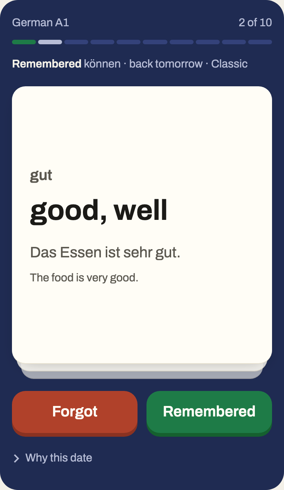

# Halflife

A free spaced-repetition flashcard app with two schedulers. Classic is SM-2,
the formula most flashcard apps have used since the 1980s. Halflife is a
trained model: half-life regression (Settles and Meeder, ACL 2016) fitted to
13 million Duolingo learning traces, which predicts how fast each memory
decays and brings a card back when recall is about to drop below your target.

Classic is the default. The model only takes over once it beats the formula
on this app's own reviews, and that test happens in public: a monthly job
retrains on opt-in logs and opens a pull request when the new weights win.
The reason it has to earn it is the main finding of the project: the Duolingo
traces carry almost no spacing signal, so a model trained on them alone
schedules cautiously and costs more reviews than SM-2 for the same retention.

Live at https://halflifecards.vercel.app. Start without an account; keep your
progress with a username when you want it on another device.

<p align="center">
  
</p>

## Results

Held-out learners the model never saw, on the reviews where scheduling
matters: a gap of at least one day since the last review (581,943 rows).

| model | MAE on recall | log-loss | AUC |
|---|---:|---:|---:|
| Leitner | 0.364 | 1.226 | 0.536 |
| SM-2 | 0.314 | 0.964 | 0.537 |
| logistic regression | 0.177 | 0.325 | 0.605 |
| half-life regression | 0.190 | 0.427 | 0.537 |

The model predicts recall far better than either rule but ranks a learner's
cards no better than they do, which is what a scheduler needs. In a 90-day
simulation against a latent memory none of them can see, tuned so each
reaches 90% realized retention, SM-2 costs 86 reviews a day and the model
153. Hence the default. `ml/REPORT.md` has every number, the calibration
tables, the ablations and the seed; `ml/reports/` will hold each promoted
retrain.

## The app

Next.js 16 on Vercel, Neon Postgres through Drizzle, Better Auth for
accounts. Nothing else runs at request time.

- Start as a guest with one tap. A guest who does nothing for 90 days is
  deleted by a daily cron.
- Keep it with a username and password. No email is collected or sent;
  a 25-character recovery code shown once at sign-up is the only way back
  in without the password, and every reset issues a fresh one.
- Every grade records what both schedulers would have done, so Stats can
  compare them on your own reviews, and a Why-this-date panel shows the
  numbers behind every card's date.
- Decks import and export as CSV; the whole account exports as one JSON
  file; deletion is one transaction. Caps of 50 decks and 20,000 cards
  per account keep the free tier honest.
- Rate limits per IP and per username on sign-in and recovery.

## Layout

```
app/             Next.js App Router pages, route handlers, the cron
components/      client components: review session, forms, charts
lib/             schedulers (hlr.ts reads the weights, sm2.ts is Classic), auth, queries, actions
api/             FastAPI service, NumPy inference, deployed as a Vercel Python function
model/           the shipped weights, versioned JSON, plus the parity fixtures
ml/              training pipeline: download, features, baselines, train, evaluate, export, retrain
content/         the starter deck and the script that builds it
drizzle/         SQL migrations
e2e/             Playwright smoke and axe tests
.github/         CI, the monthly retrain workflow, the version 2 gate
```

## The service

`api/index.py` serves `/api/py/predict`, `/api/py/schedule`, `/api/py/model` and
`/api/py/health`. It loads the newest `model/weights.v<N>.json` at import time
and computes in NumPy. Vercel builds it as a Python function; `api/_inference.py`
starts with an underscore so Vercel does not build it as a second function.
The app calls it with a 1.5 second budget and falls back to the TypeScript
port in `lib/scheduler/hlr.ts`, which computes the same numbers.

## Run it locally

Needs Node 20+, Python 3.12 and [uv](https://docs.astral.sh/uv/).

```
cp .env.example .env.local          # a Neon connection string and a secret
npm install
npm run db:migrate
cd ml && uv sync && cd ..            # the environment the Python function runs in
ml/.venv/bin/uvicorn api.index:app --port 8000
npm run dev                          # rewrites /api/py/* to port 8000
```

## Checks

```
npm run typecheck && npm run lint && npm test
cd ml && uv run ruff check . ../api && uv run pytest
npx playwright install chromium && npm run e2e
```

CI runs the first two on every push. The Playwright suite drives a real dev
server against the database in `.env.local` with the Python function pointed
at a dead port, so every prediction goes through the fallback: guest to
review to sign-up to recovery, plus an axe pass on every screen at desktop
and phone widths.

## Parity

The Python function, the training code and the TypeScript fallback must
agree. `ml/export.py` writes `model/parity_fixtures.json` from the shipped
weights, and `ml/tests/test_export.py`, `ml/tests/test_api.py` and
`lib/scheduler/hlr.test.ts` assert the same half-life, recall and next
interval to six decimal places.

## How to train

```
cd ml
uv run python -m data.download          # 379 MB from Harvard Dataverse, checksum verified
uv run python -m train configs/hlr_v1.yaml --name v1
uv run python -m evaluate --hlr runs/v1  # writes ml/REPORT.md and the figures
uv run python -m export runs/v1 --version 1
```

The split holds out learners, not rows, and the config records the seed.

## How the model is promoted

`ml/retrain.py` pulls every review from users who have not opted out of
sharing logs: the counts seen and remembered, the gap, the response time, the
outcome, a hashed user id and the card's shared key. Never card text. It
fine-tunes the global weights from the shipped file, learns a per-card term
for each card key, and scores the candidate and the current model on a
held-out slice: by user when there are five or more opted-in users, otherwise
each user's latest reviews.

`.github/workflows/retrain.yml` runs it on the first of every month, or by
hand. If held-out log-loss improves, the workflow writes
`model/weights.v<N+1>.json` and new parity fixtures, points
`lib/scheduler/weights.ts` at the new file, runs the parity tests, and opens a
pull request whose body is the run's report. If not, it only writes the report
to the job summary. Nothing reaches production without a merged pull request.
Making the model the default scheduler is a one-line change in such a pull
request.

## Version 2

Version 1 sees only counts. A small sequence model over a card's last reviews
could tell "wrong, right, right" from "right, right, wrong", but there is
nothing to train it on yet. The retrain job counts shared spaced reviews and
opens an issue at 50,000; the gates it must pass are in
`.github/version-2-issue.md`.

## If something breaks

Vercel keeps every deployment. To roll back, open the project on Vercel,
pick the last good deployment under Deployments, and choose Promote to
Production; the previous build is live within a minute and nothing needs
rebuilding. To roll forward, push a fix to `main`; CI runs first.

The database is Neon. Its point-in-time restore can rewind the branch to any
moment inside the retention window, from the Neon console under Restore.
Every user can also export their account as one JSON file from the account
page, and every deck as CSV, so a learner's data never depends on either.

Secrets the app needs on Vercel: `DATABASE_URL`, `BETTER_AUTH_SECRET`,
`CRON_SECRET`. The daily purge cron logs a `200` under Cron Jobs when the
secret is set; a `401` there means it is missing.

## Licence

Code is MIT. The trained weights derive from CC BY-NC 4.0 data and stay
non-commercial; the starter deck is CC BY-SA 4.0. See LICENSE.

## Attribution

Model and training data: Settles, B. and Meeder, B. (2016). A Trainable Spaced
Repetition Model for Language Learning. ACL 2016, pages 1848 to 1858.
Paper: https://doi.org/10.18653/v1/P16-1174. Data: https://doi.org/10.7910/DVN/N8XJME,
CC BY-NC 4.0. Reference code: https://github.com/duolingo/halflife-regression, MIT.
Starter deck: FrequencyWords (OpenSubtitles), CC BY-SA 4.0.
This project is non-commercial.
