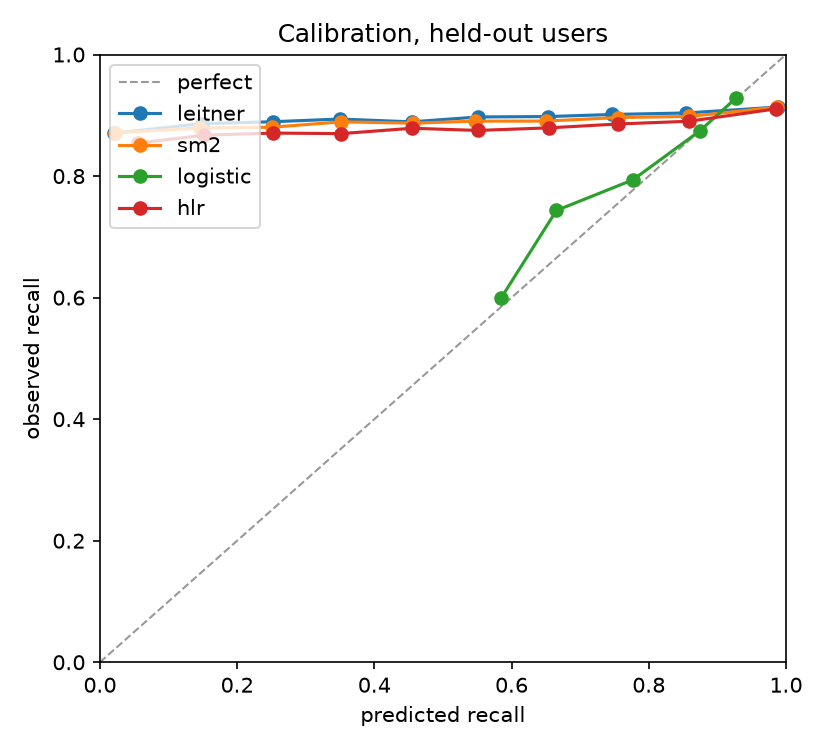
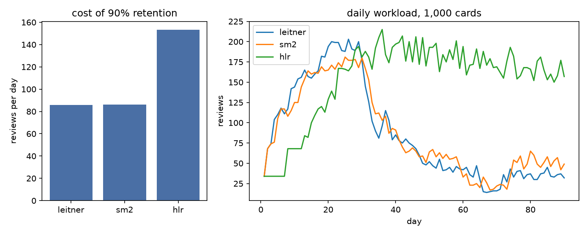

# Halflife model report

Generated 2026-09-13 22:30 by `ml/evaluate.py`. Every number here is
reproducible with `uv run python -m evaluate` in `ml/`.

## Data

Duolingo learning traces, Settles and Meeder 2016, doi:10.7910/DVN/N8XJME, CC BY-NC 4.0.
12,854,226 rows, 115,222 users, 19,279 lexemes, 11.9 days.

## Split

Held out by user, not by row, so every model is scored on learners it never saw.
Seed 42, test fraction 0.1: 103,840 train users (11,617,839 rows), 11,382 test users (1,236,387 rows).

## Metrics

`mae_p` is per row, the paper's headline. `log_loss` and `auc` are per trial: a row with
`session_seen` attempts counts that many times. `spearman_h` and `pearson_h` correlate
the predicted half-life with the half-life implied by the observed recall.

### Held-out users, all rows

| model | rows | mae_p | log_loss | auc | spearman_h | pearson_h |
|---|---:|---:|---:|---:|---:|---:|
| leitner | 1,236,387 | 0.2241 | 0.9119 | 0.5457 | -0.1039 | -0.1132 |
| sm2 | 1,236,387 | 0.2016 | 0.7810 | 0.5518 | 0.0060 | -0.0196 |
| logistic | 1,236,387 | 0.1618 | 0.3039 | 0.6115 | n/a | n/a |
| hlr | 1,236,387 | 0.1381 | 0.5629 | 0.5431 | 0.0750 | 0.0707 |

### Held-out users, rows with at least 3 prior reviews

| model | rows | mae_p | log_loss | auc | spearman_h | pearson_h |
|---|---:|---:|---:|---:|---:|---:|
| leitner | 1,070,636 | 0.1905 | 0.7996 | 0.5460 | -0.0681 | -0.0843 |
| sm2 | 1,070,636 | 0.1658 | 0.6409 | 0.5539 | 0.0628 | 0.0249 |
| logistic | 1,070,636 | 0.1605 | 0.3025 | 0.6112 | n/a | n/a |
| hlr | 1,070,636 | 0.1363 | 0.5688 | 0.5425 | 0.0771 | 0.0659 |

### Held-out users, spaced reviews with a gap of at least 1 day

Where scheduling actually matters. Half-life regression assumes perfect recall at a
gap of zero, and 30% of the traces are same-session repeats with 8% failures that
no forgetting curve can fit. This subset compares the models on real spaced reviews.

| model | rows | mae_p | log_loss | auc | spearman_h | pearson_h |
|---|---:|---:|---:|---:|---:|---:|
| leitner | 581,943 | 0.3644 | 1.2257 | 0.5355 | 0.0485 | 0.0373 |
| sm2 | 581,943 | 0.3143 | 0.9641 | 0.5371 | 0.0454 | 0.0449 |
| logistic | 581,943 | 0.1766 | 0.3247 | 0.6049 | n/a | n/a |
| hlr | 581,943 | 0.1903 | 0.4267 | 0.5370 | 0.0940 | 0.0987 |

### Calibration on held-out users

**leitner**

| bin     |   predicted |   observed |   trials |
|:--------|------------:|-----------:|---------:|
| 0.0-0.1 |       0.021 |      0.871 |   153693 |
| 0.1-0.2 |       0.148 |      0.886 |    45020 |
| 0.2-0.3 |       0.252 |      0.889 |    44026 |
| 0.3-0.4 |       0.350 |      0.894 |    43143 |
| 0.4-0.5 |       0.454 |      0.889 |    47563 |
| 0.5-0.6 |       0.552 |      0.897 |    62776 |
| 0.6-0.7 |       0.653 |      0.898 |    62855 |
| 0.7-0.8 |       0.747 |      0.901 |   103703 |
| 0.8-0.9 |       0.854 |      0.904 |   148311 |
| 0.9-1.0 |       0.989 |      0.914 |  1537470 |

**sm2**

| bin     |   predicted |   observed |   trials |
|:--------|------------:|-----------:|---------:|
| 0.0-0.1 |       0.022 |      0.871 |   107873 |
| 0.1-0.2 |       0.146 |      0.879 |    33523 |
| 0.2-0.3 |       0.250 |      0.880 |    33538 |
| 0.3-0.4 |       0.352 |      0.889 |    29718 |
| 0.4-0.5 |       0.457 |      0.887 |    41706 |
| 0.5-0.6 |       0.547 |      0.890 |    54821 |
| 0.6-0.7 |       0.650 |      0.890 |    56175 |
| 0.7-0.8 |       0.755 |      0.896 |    90337 |
| 0.8-0.9 |       0.859 |      0.898 |   157301 |
| 0.9-1.0 |       0.987 |      0.913 |  1643568 |

**logistic**

| bin     |   predicted |   observed |   trials |
|:--------|------------:|-----------:|---------:|
| 0.0-0.1 |     nan     |    nan     |        0 |
| 0.1-0.2 |     nan     |    nan     |        0 |
| 0.2-0.3 |     nan     |    nan     |        0 |
| 0.3-0.4 |     nan     |    nan     |        0 |
| 0.4-0.5 |     nan     |    nan     |        0 |
| 0.5-0.6 |       0.585 |      0.600 |       25 |
| 0.6-0.7 |       0.665 |      0.743 |      491 |
| 0.7-0.8 |       0.777 |      0.794 |    17366 |
| 0.8-0.9 |       0.875 |      0.874 |   857311 |
| 0.9-1.0 |       0.927 |      0.928 |  1373367 |

**hlr**

| bin     |   predicted |   observed |   trials |
|:--------|------------:|-----------:|---------:|
| 0.0-0.1 |       0.055 |      0.854 |     5161 |
| 0.1-0.2 |       0.152 |      0.867 |     9586 |
| 0.2-0.3 |       0.252 |      0.871 |    11045 |
| 0.3-0.4 |       0.352 |      0.870 |    12615 |
| 0.4-0.5 |       0.455 |      0.879 |    17360 |
| 0.5-0.6 |       0.551 |      0.875 |    24108 |
| 0.6-0.7 |       0.655 |      0.879 |    36485 |
| 0.7-0.8 |       0.755 |      0.886 |    64910 |
| 0.8-0.9 |       0.859 |      0.890 |   146056 |
| 0.9-1.0 |       0.985 |      0.911 |  1921234 |

## The trained model

Run `v1_logloss`: objective logloss, half-life loss
weight 0, 4 epochs,
seed 42.

| feature | weight |
|---|---:|
| bias | 7.0373 |
| sqrt_seen | -0.9933 |
| sqrt_correct | 1.1499 |
| sqrt_wrong | -0.7728 |
| log_days_since_first | 0.0000 |
| log_response_s | 0.0000 |

Predicted half-life in days for a few card states, global weights only, no
per-lexeme term. This is what the app sees for a card nobody has reviewed yet.

| card state | half-life (days) |
|---|---:|
| 1 seen, 1 right | 89.6 |
| 3 seen, 3 right | 95.5 |
| 3 seen, 1 right | 40.5 |
| 10 seen, 9 right | 78.0 |
| 10 seen, 5 right | 25.4 |

### Ablation on held-out users

| run | objective | h loss wt | lexeme | mae_p | log_loss | auc | spearman_h |
|---|---|---:|---|---:|---:|---:|---:|
| v1_logloss | logloss | 0 | True | 0.1381 | 0.5629 | 0.5431 | 0.0750 |
| v1_paperloss | mse | 0.01 | True | 0.1214 | 0.5761 | 0.5371 | 0.1985 |
| v1_nolex | logloss | 0 | False | 0.1380 | 0.5631 | 0.5430 | 0.0738 |

## Workload simulation

A synthetic learner studies 1,000 cards over 90 days against a latent
memory the schedulers never see (see `simulate.py` for the ground truth). Each
scheduler gets one knob, tuned until realized retention is
90%: an interval multiplier for the fixed schedulers, the target
retention for the model. The cost is reviews per day at that setting.

| scheduler | knob | realized retention | reviews per day |
|---|---:|---:|---:|
| leitner | 0.567 | 0.900 | 85.7 |
| sm2 | 0.468 | 0.900 | 86.3 |
| hlr | 0.946 | 0.900 | 153.2 |

## Check against the reference implementation

The MIT reference splits the first 90% of rows from the last 10% in file order.
Scores on that split, for comparison with the paper's Table 2 (Leitner: MAE 0.235,
AUC 0.542, cor(h) 0.193; LR: MAE 0.211, AUC 0.514). `auc_paper` labels each row by
rounding p_recall, as the paper's `evaluation.r` does. On the first 1.3M rows the
reference script and this code agree to three decimals on MAE, mean half-life error
and Pearson cor(h), so the released code does not reproduce the paper's positive
Leitner cor(h); this report uses the released code's numbers.

| model | rows | mae_p | log_loss | auc | spearman_h | pearson_h | auc_paper |
|---|---:|---:|---:|---:|---:|---:|---:|
| leitner | 1,285,423 | 0.2348 | 0.9572 | 0.5450 | -0.0975 | -0.1051 | 0.5422 |
| sm2 | 1,285,423 | 0.2180 | 0.8297 | 0.5555 | 0.0054 | -0.0202 | 0.5579 |
| logistic | 1,285,423 | 0.1648 | 0.3076 | 0.6166 | n/a | n/a | 0.6260 |

## Notes

- Leitner reads 2^(correct - wrong) days as the half-life, as in the paper.
- SM-2 is Anki's variant with binary grades, replayed per user-lexeme in time order.
  Its scheduled interval is read as the half-life. Pre-window history is seeded from
  counts with lapses first, the pessimistic order.
- Logistic regression uses sqrt(1+correct), sqrt(1+wrong), log(1 + gap in days), a bias
  and a lexeme one-hot, scikit-learn lbfgs with default L2 (C=1), fitted on trials.
  It predicts no half-life, so its half-life correlations are not applicable.
